# 在线做题系统项目文档

---

> **作者：[猛良](https://github.com/wuguang434)**

## 📌 项目介绍

本项目是基于 Spring Boot + Spring Cloud Alibaba 微服务 + Docker + RabbitMQ + Vue 3 的 **编程算法题目在线评测系统（简称OJ）**。在线访问该系统，用户可以选择题目、编写代码并提交代码进行评测，通过高效、稳定的在线判题评测系统进行代码的编译、运行和结果判定。

---

## 🛠 项目功能

### 1️⃣ 题目模块

- 创建题目（管理员）
- 删除题目（管理员）
- 修改题目（管理员）
- 搜索题目（用户/管理员）
- 题目管理（管理员）
- 在线做题（用户/管理）
- 提交题目代码（用户/管理）
- 消息队列：防止判题服务执行时间过长，并使用死信队列处理判题失败的题目，避免消息积压。

### 2️⃣ 用户模块

- 注册
- 登录（微服务中使用JWT Token实现登录，在网关层面获取token登录消息，实现用户鉴权）
- 用户管理（管理员）
- 用户上传头像功能（使用阿里云对象存储OSS存储图片）
- 用户限流（使用Redisson实现简单且高效分布式限流，限制用户每秒只能提交一次题目，防止用户恶意占用系统资源）

### 3️⃣ 判题模块

- 提交判题：结果是否正确与错误
- 错误处理：内存溢出、安全性、超时
- 代码沙箱：执行代码，返回执行信息
- 开放接口：提供一个独立的新服务

### 4️⃣ 代码沙箱

- 只负责接受代码和输入，运行代码，返回编译运行的结果，不负责判题

---

## 🌟 项目核心亮点

- 权限校验
- 代码沙箱（安全沙箱）
- 判题规则
- 任务调度（消息队列执行判题）

---

## 🚀 快速启动

1. 下载/拉取本项目到本地（包括后端、代码沙箱和前端模块）
2. 通过 IDEA 代码编辑器打开项目，等待依赖下载
3. 修改 `application.yaml` 配置文件，配置数据库、Redis、RabbitMQ等信息
4. 修改完成后，通过 `CyuApplication` 程序运行项目

---

## 📊 项目结构图

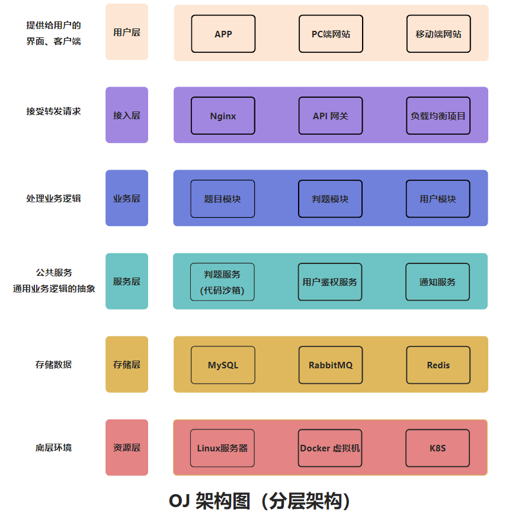

---

## 🔥 项目核心业务流程

判题服务与代码沙箱实现了解耦，判题服务负责获取题目信息、预设的输入输出结果，返回给主业务后端：用户的答案是否正确。而代码沙箱仅负责运行代码，给出程序运行的结果。
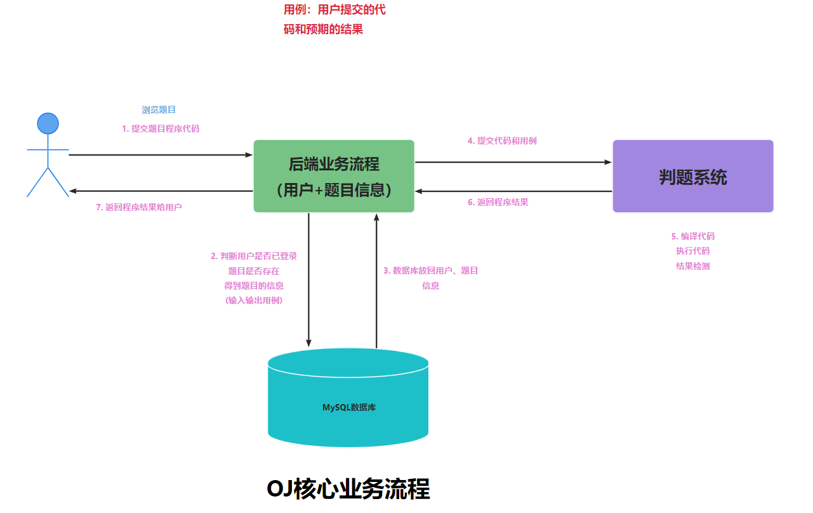
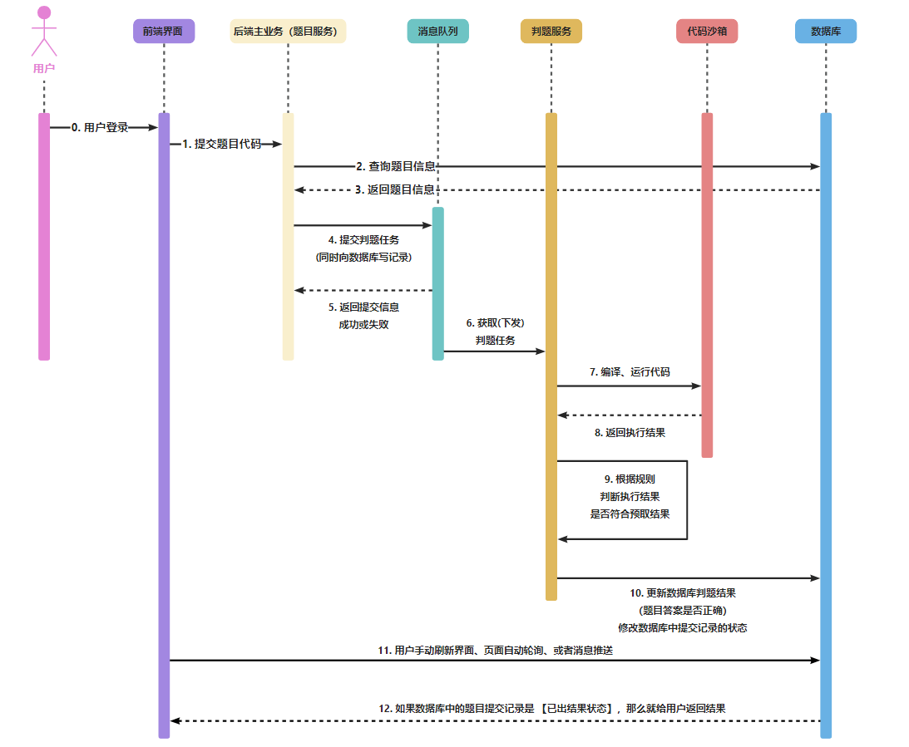

---

## 🏗 微服务项目

### 服务模块划分

- cyuoj-backend-common：系统通用模块
- cyuoj-backend-file-service：系统文件模块
- cyuoj-backend-gateway：系统网关模块
- cyuoj-backend-judge-service：系统判题模块
- cyuoj-backend-model：系统实体模块
- shier-backend-question-service：系统题目模块
- cyuoj-backend-service-client：系统内部调用模块
- cyuoj-backend-user-service：系统用户模块

---

## 📚 项目技术栈和特点

### 后端

- Spring Boot、Spring MVC、Spring AOP、Spring 事务注解等
- Spring Cloud Alibaba、Spring Gateway
- MyBatis + MyBatis Plus 数据访问（开启分页）
- Redis、Redisson
- JWT Token、RabbitMQ
- Docker 代码沙箱
- Nacos、OpenFeign

### 前端

- Vue 3、Vue Router、Vue-Cli
- Axios、Bytemd、Monaco Editor
- highlight.js、Moment.js
- Arco Design Vue、TypeScript

### 数据存储

- MySQL 数据库

### 通用特性

- Spring Session Redis 分布式登录
- 全局请求响应拦截器（记录日志）
- 自定义权限注解 + 全局校验
- Swagger + Knife4j 接口文档

### 单元测试

- JUnit5 单元测试、业务功能单元测试

### 设计模式

- 模板模式、静态工厂模式、代理模式、策略模式

### 远程开发

- VMware Workstation虚拟机、Ubuntu Linux 18、Docker环境、使用JetBrains Client连接

---

## 🖼 OJ项目展示

### 项目首页

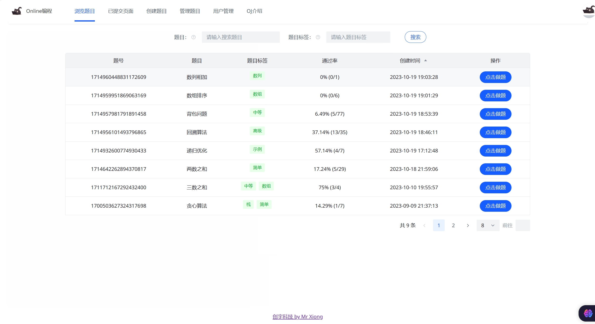

### 做题页面

### 用户登录注册

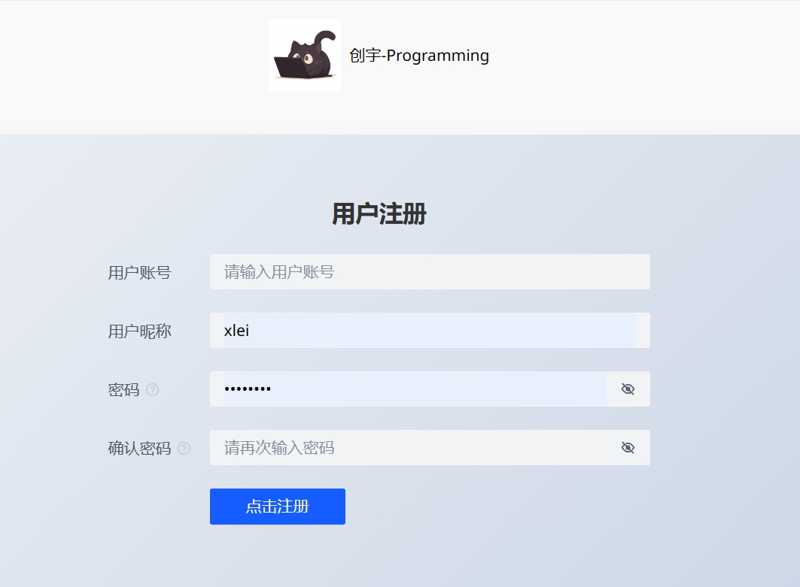
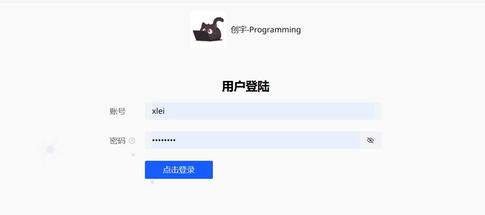

### 管理员创建题目

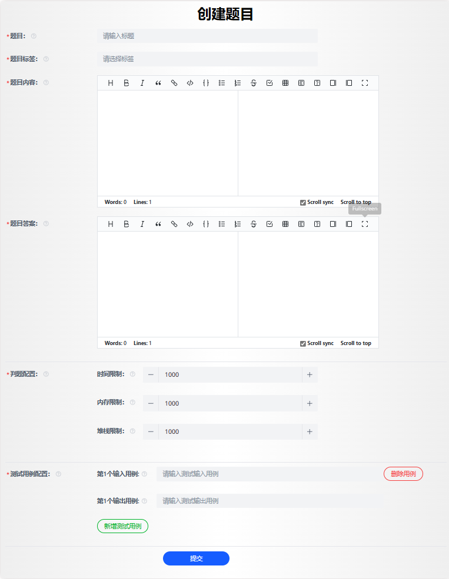

### 题目管理

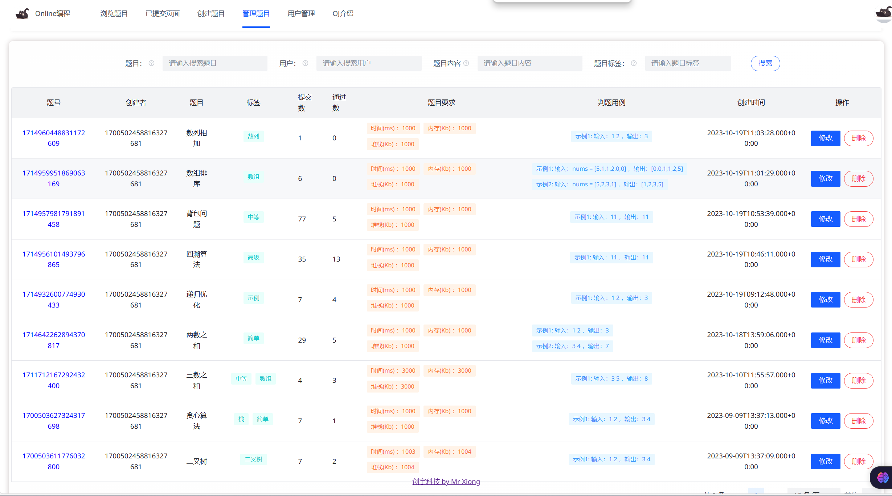

### 修改题目信息

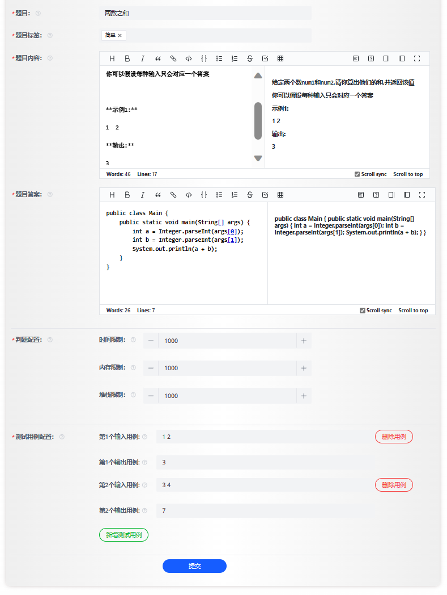

### 用户管理（管理员）

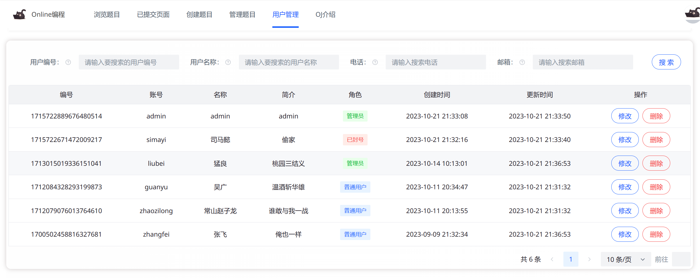
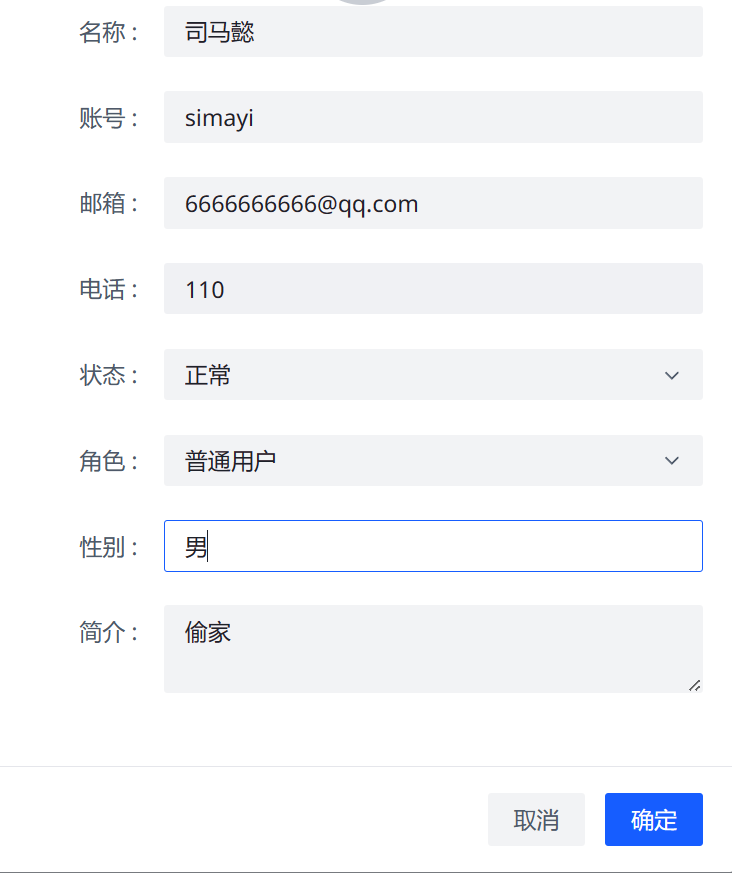

### 提交题目展示

---

## 🌱 后续项目计划

- 多语言代码沙箱
- 实现ACM模式

---